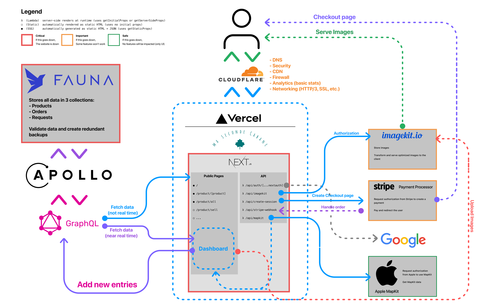

# Ma Seconde Cabane
Ma Seconde Cabane is an e-commerce site built on top of the NextJS & Vercel ecosystem for scalability, reliability and maintainability reasons.

## Working on the website
My name is [Arthur Guiot](https://arguiot.com) and I'm the developer who coded this website. I wrote this document to make sure you can understand how I coded this website.

To work on the site, you must have a good knowledge of NextJS, React, GraphQL, NodeJS and the [JAMStack](https://jamstack.org) and serverless concepts.

To launch the development server:
```sh
yarn install
yarn dev
```

## Stack
Here is the stack I used.


> Each platform mentionned here requires authentification, so if you ever need the tokens or something else, please contact me

### Architecture
The site was designed in the JAMStack architecture in order to reduce infrastructure and maintenance costs to more or less nothing at all. It is also easier to expand and there is no need to worry about security (except during the development time of course). It also encourages to simplify things and to keep only the bare necessities.

The motivations behind the choice of NextJS are mainly for time savings. The deadline for creating the site was vague, and I preferred to work fast to satisfy the customer's needs. NextJS was the ideal solution because it allowed me to opt for a declarative (React) rather than imperative (Vanilla JS) architecture. The benefit was mainly to reduce bugs and make the state of each component predictable.

## Networking
Networking is managed by Cloudflare for performance, security and caching reasons. Cloudflare is positioned virtually in front of Vercel's Edge Network (AWS Cloudfront). Although Cloudflare's loading performance is slightly slowed down by Cloudflare (additional step), I notice a clear improvement with the navigation on the site (thanks to HTTP 3 and QUIC). That said, when Cloudfront supports this configuration, it will be possible to disable Cloudflare with a single click from the dashboard. But since the difference is minimal, it is preferable to keep the configuration active for security and insights reasons. In fact, Cloudflare offers an analytics service that can be useful for the administrator to determine customer interests. Fianlly, Cloudflare also helps reduicng the bandwidth usage, as it serves cached ressources when it can (on average, more than a third of the total bandwidth usage is saved).


## Frontend and design considerations
The frontend is written in React (trivial, since the site is based on the Next ecosystem), and is meant to be static (SSG) in most cases. Most of the components are either designed by hand or are based on the [Geist](https://geist-ui.dev) design system.

The front end is designed to respect the guidelines set forth by [Pr1mer](https://guidelines.pr1mer.tech), and therefore supports mobile devices or dark mode for example.