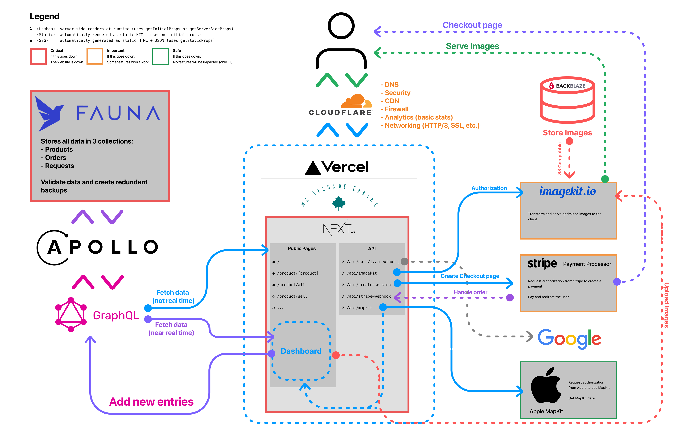

# Ma Seconde Cabane
Ma Seconde Cabane is an e-commerce site built on top of the NextJS & Vercel ecosystem for scalability, reliability and maintainability reasons.

## Working on the website
My name is [Arthur Guiot](https://arguiot.com) and I'm the developer who coded this website. I wrote this document to make sure you can understand how I coded this website.

To work on the site, you must have a good knowledge of NextJS, React, GraphQL, NodeJS and the [JAMStack](https://jamstack.org) and serverless concepts.

To launch the development server:
```sh
yarn install
yarn dev
```

### Dashboard
The dahsboard is located in a different git repository (as I started the development of this website prior to the monorepo support of Vercel). The configuration between the main and dashboard repo is roughfly the same.

## Stack
Here is the stack I used.


> Each platform mentionned here requires authentification, so if you ever need the tokens or something else, please [contact me](mailto:arguiot@gmail.com)

### Architecture
The site was designed in the JAMStack architecture in order to reduce infrastructure and maintenance costs to more or less nothing at all. It is also easier to expand and there is no need to worry about security (except during the development time of course). It also encourages to simplify things and to keep only the bare necessities.

The motivations behind the choice of NextJS are mainly for time savings. The deadline for creating the site was vague, and I preferred to work fast to satisfy the customer's needs. NextJS was the ideal solution because it allowed me to opt for a declarative (React) rather than imperative (Vanilla JS) architecture. The benefit was mainly to reduce bugs and make the state of each component predictable.

## Networking
Networking is managed by Cloudflare for performance, security and caching reasons. Cloudflare is positioned virtually in front of Vercel's Edge Network (AWS Cloudfront). Although Cloudflare's loading performance is slightly slowed down by Cloudflare (additional step), I notice a clear improvement with the navigation on the site (thanks to HTTP 3 and QUIC). That said, when Cloudfront supports this configuration, it will be possible to disable Cloudflare with a single click from the dashboard. But since the difference is minimal, it is preferable to keep the configuration active for security and insights reasons. In fact, Cloudflare offers an analytics service that can be useful for the administrator to determine customer interests. Fianlly, Cloudflare also helps reduicng the bandwidth usage, as it serves cached ressources when it can (on average, more than a third of the total bandwidth usage is saved).

The only part of the website not going through Cloudflare's edge network is the dashboard as it created a very rare issue with Safari 14 in the authentication process. Cloudlfare's security and aggressive caching techniques didn't seemed to work well with Safari for some reasons.

## Frontend and design considerations
The frontend is written in React (trivial, since the site is based on the Next ecosystem), and is meant to be static (SSG) in most cases. Most of the components are either designed by hand or are based on the [Geist](https://geist-ui.dev) design system.

The front end is designed to respect the guidelines set forth by [Pr1mer](https://guidelines.pr1mer.tech), and therefore supports mobile devices or dark mode for example.

## Security
Security in an e-commerce site is paramount. The first level of security used here is the JAMStack + Cloud architecture (indeed, no central servers means no vulnerabilities). The second level of security to take into account is simply not to fear hacking: the site does not store any passwords, no credit cards, and extremely little confidential information. Finally, the site is designed with the Zero Trust in mind for each request, and those for the client and the administrator.


#### Zero Trust
The philosophy behind a zero trust network assumes that there are attackers both within and outside of the network, so no users or machines should be automatically trusted.

Zero trust security is an IT security model that requires strict identity verification for every person and device trying to access resources on a private network, regardless of whether they are sitting within or outside of the network perimeter. No single specific technology is associated with zero trust architecture; it is a holistic approach to network security that incorporates several different principles and technologies.

Traditional IT network security is based on the castle-and-moat concept. In castle-and-moat security, it is hard to obtain access from outside the network, but everyone inside the network is trusted by default. The problem with this approach is that once an attacker gains access to the network, they have free reign over everything inside.

This vulnerability in castle-and-moat security systems is exacerbated by the fact that companies no longer have their data in just one place. Today, information is often spread across cloud vendors, which makes it more difficult to have a single security control for an entire network.

Zero trust security means that no one is trusted by default from inside or outside the network, and verification is required from everyone trying to gain access to resources on the network.

Here is a non-exhaustive list that this implies:
- never give the client (front end) an API key with more rights than it needs. (For example, in the administration panel, the admin key can only be loaded by the browser after logging in).
- Check each request (internal and external). For example, the WebHook API for Stripe to validate the transaction checks the signature to make sure that only Stripe can send the request.
- Identify attacks before they succeed (part managed by CloudFlare).

## Mantainability
The website doesn't require much, but sometimes a bit of clearing might help. I recommend doing this every 3 or 6 months (but might be lower depending on the traffic and usage):
- Update dependencies (to make sure that the website is safe, secure and fast).
- Redeploy with Vercel (this will help generate new pages, without having to do it dynamically)
- Check the database (delete old records, etc.)
- Check the image database (delete old images, etc.)
- Verify bandwidth usage, database usage, imagekit usage and blackblaze usage. Other services used offer free tiers that will theorically never be exceeded.